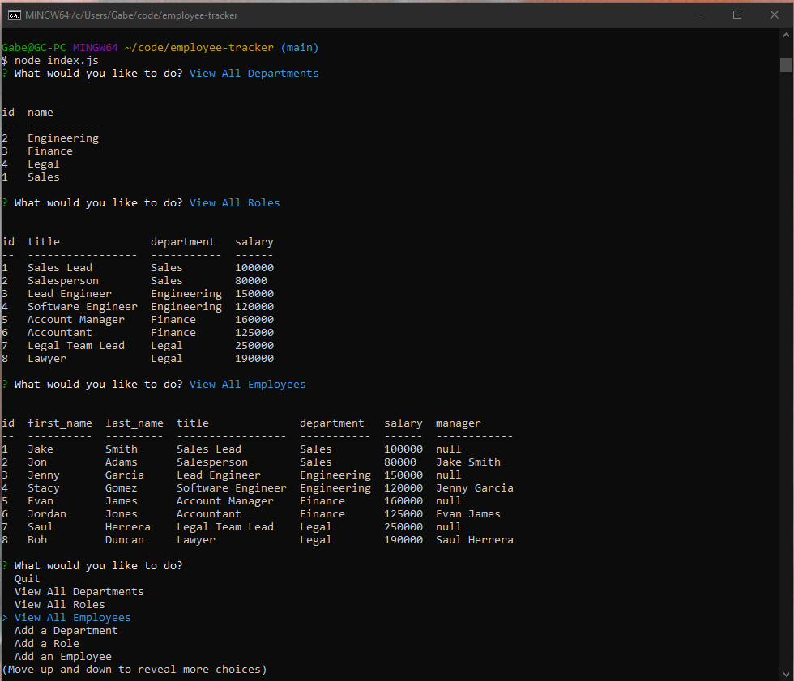

# Employee Tracker

## Description
A CMS app that allows you to look at a database of employees, departments and roles. Lets you add new departments, roles, employees, or update an employees.

## Table of Contents
* [Video Walkthrough](#video)
* [Installation](#installation)
* [Usage](#usage)
* [Technologies Used](#tech)
* [License](#license)

## Video Walkthrough
https://drive.google.com/file/d/1fHmgMrdCyTPob_60okiyESJfR2-UOByS/view?usp=sharing

## Installation

*Steps required to install this project and get the application running:*
Npm i, node index.js in terminal

## Usage
*Instructions for use:*
Arrow keys let you go up and down to select. Questions will be prompted for you to type in the answer. Quit lets you exit application.

## Tech

## License

Open

### Questions?
For any questions, please contact me with the information below:
GitHub: [babelitoo](https://github.com/babelitoo)
